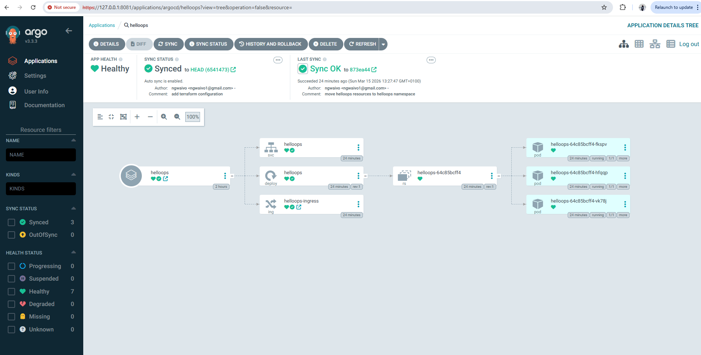
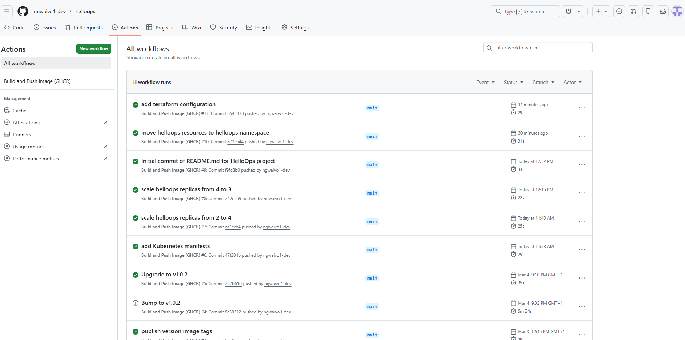
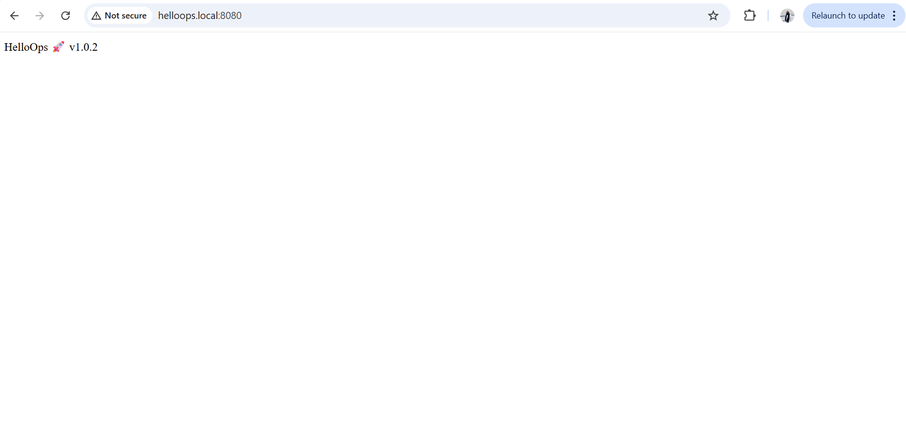
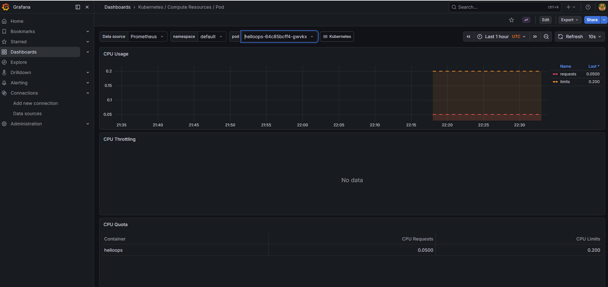

# HelloOps — End-to-End DevOps GitOps Project

> Automated cloud-native deployments using Git as the single source of truth.

HelloOps is a full end-to-end DevOps project showcasing modern deployment practices with **Docker, Kubernetes, ArgoCD, Prometheus, and Grafana**. Every infrastructure and application change flows through Git and is automatically reconciled into the cluster by ArgoCD.

---

## Tech Stack

| Tool | Purpose |
|---|---|
| Python Flask | Application backend |
| Docker | Containerization |
| Kubernetes | Container orchestration |
| Minikube | Local Kubernetes cluster |
| ArgoCD | GitOps continuous delivery |
| Prometheus | Metrics collection |
| Grafana | Monitoring dashboards |
| GitHub Actions | CI/CD pipeline |
| NGINX Ingress | Application routing |

---

## Architecture

### End-to-End Deployment Flow
```
Developer
    ↓ Git Commit
GitHub
    ↓ GitHub Actions — Build & push Docker image
Container Registry
    ↓ ArgoCD detects change
Kubernetes Cluster — Auto-updated
```

### Kubernetes Resource Hierarchy
```
ArgoCD Application
    └── Deployment
            └── ReplicaSet
                    └── Pods
                            └── Service
                                    └── Ingress
```

The cluster provides:
- **Self-healing** — failed pods restart automatically
- **Rolling deployments** — zero-downtime updates
- **Declarative infrastructure** — desired state defined in Git
- **Git-driven updates** — no manual `kubectl apply` needed in production

---

## GitOps Workflow (ArgoCD)

### Manual Sync
```
Git change → ArgoCD detects drift → Manual sync triggered → Cluster updated
```

### Auto Sync
```
Git push → ArgoCD auto-deploys → Kubernetes reconciles desired state
```

---

## Features

### Containerization
- Dockerized Flask API with a lightweight production image

### Kubernetes Deployment
- `Deployment`, `Service`, and `Ingress` manifests
- Horizontal Pod Autoscaler (HPA) configured

### High Availability
- Multi-replica pod setup
- Rolling update strategy
- Automatic container restarts on failure

### GitOps with ArgoCD
- Continuous reconciliation
- Auto-sync enabled
- Drift detection and alerting

### Observability
- Prometheus scraping application metrics
- Grafana dashboards for real-time visibility

---

## Repository Structure
```
helloops/
├── app/
│   └── app.py
├── .github/
│   └── workflows/
│       └── ci.yml
├── k8s/
│   ├── deployment.yaml
│   ├── service.yaml
│   ├── ingress.yaml
│   └── hpa.yaml
├── Dockerfile
├── requirements.txt
└── README.md
```

---

## Local Setup

**1. Start the local Kubernetes cluster**
```bash
minikube start
```

**2. Deploy the application**
```bash
kubectl apply -f k8s/
```

**3. Install ArgoCD**
```bash
kubectl create namespace argocd
kubectl apply -n argocd -f https://raw.githubusercontent.com/argoproj/argo-cd/stable/manifests/install.yaml
```

---

## Example GitOps Change — Scaling via Git

Update your deployment manifest:
```yaml
# k8s/deployment.yaml
replicas: 4
```

Commit and push:
```bash
git add .
git commit -m "chore: scale helloops to 4 replicas"
git push origin main
```

ArgoCD detects the change and automatically updates the cluster — no manual intervention required.

---

## Lessons Learned

Real-world DevOps challenges solved during this project:

- GitOps synchronization and reconciliation with ArgoCD
- Kubernetes rolling update strategies
- Resolving HPA conflicts with GitOps-managed replica counts
- NGINX Ingress networking on Minikube (Windows)
- Setting up end-to-end observability with Prometheus and Grafana

---

## Roadmap

- [ ] Infrastructure provisioning with Terraform
- [ ] Helm chart packaging
- [ ] Load testing and performance benchmarking
- [ ] Production cloud deployment on AWS EKS

## Screenshots

### ArgoCD Deployment


### GitHub Actions Pipeline


### Application Running


### Grafana Monitoring Dashboard
